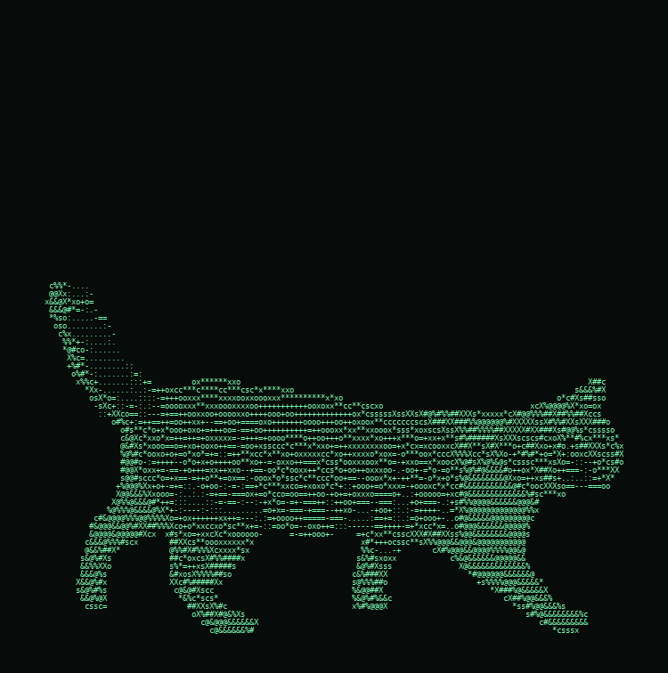
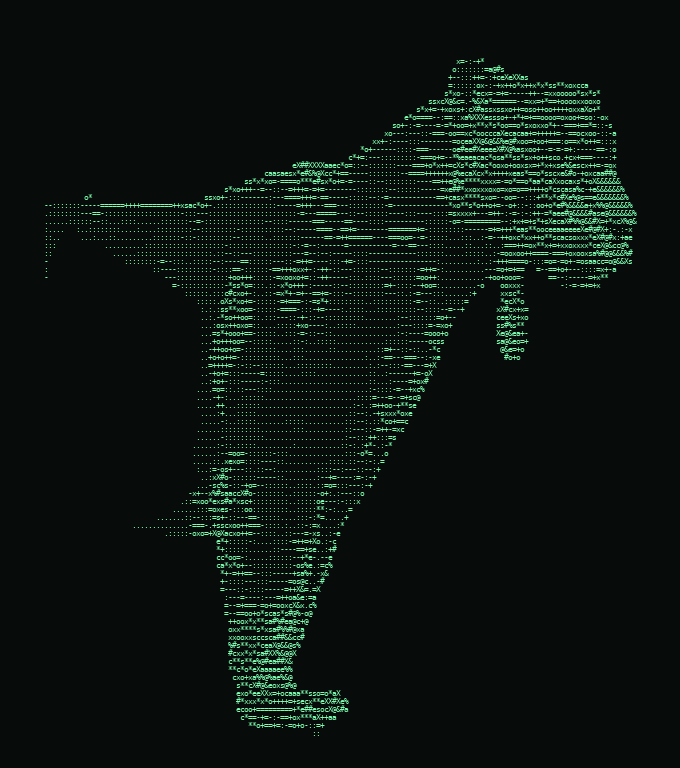

# JAMMSPRITE

**Turn real video or photos into clean, animated ASCII sprites.**

[](https://github.com/JAMMx2/JAMMSPRITE/actions/workflows/ci.yml)
[](https://github.com/JAMMx2/JAMMSPRITE/blob/main/pyproject.toml)
[](LICENSE)
[](CHANGELOG.md)

Feed it a short clip of a cat walking (or anything), and it gives you back a
game-ready sprite made entirely of text glyphs — plus an animated preview and a
sprite sheet. It's the engine behind [Stella](#the-story), a photoreal cat
rendered in phosphor-green ASCII.

<p align="center">
  
  
</p>

---

## Why it looks good

Most "image to ASCII" scripts just map pixel brightness to characters and call
it a day — you get a noisy rectangle with the background baked in. This does the
opposite: it isolates the **subject**, cleans the silhouette, and fills it
solidly, so you get a crisp *sprite*, not a screenshot.

Per frame:

```
source image / video frame
  → background removal        (rembg, isnet-general-use)
  → silhouette cleanup        (largest blob · fill holes · smooth · trim halo)
  → crop to subject + pad
  → fit into a glyph grid      (preserve aspect · margins · feet on the floor)
  → sample brightness → ramp   (keep original RGB per cell)
  → SOLID FILL + despeckle     (dark fur never punches holes · no stray glyphs)
  → ASCII frame {chars, colors}
```

The two ideas that make it read as a sprite:

- **Solid fill** — every pixel *inside* the subject maps to at least a faint
  character. Blank space is reserved for *outside* the subject, so dark fur
  doesn't leave holes in the body.
- **Despeckle + largest-blob** — floating stray glyphs and stray cutout islands
  are dropped, so the silhouette is clean.

---

## Install

```bash
pip install git+https://github.com/JAMMx2/JAMMSPRITE.git
# ffmpeg is only needed for video input:
#   macOS:  brew install ffmpeg
#   Ubuntu: sudo apt install ffmpeg
#   Windows: winget install ffmpeg
```

First run downloads the background-removal model (~170 MB) once.

For hacking on it instead, see [CONTRIBUTING.md](CONTRIBUTING.md).

---

## Usage

```bash
# a short video clip → a 16-frame walk cycle
jammsprite walk.mp4 --name walk --start 1.6 --dur 3.0 --frames 16

# a single still  (use a FLAT GRAY or GREEN background — see Tips)
jammsprite cat.png --name idle

# a single still, gently "breathing" (synthesised motion — great for sleep)
jammsprite cat.png --name sleep --breathe 8

# a folder of pre-extracted frames, rendered in colour
jammsprite ./frames_dir --name run --color

# amber CRT look, facing left, plus a pre-mirrored copy in the JSON
jammsprite walk.mp4 --name walk --tint amber --flip --both-ways

# convert, then play it right in your terminal
jammsprite cat.png --name idle --breathe 8 --play
```

(`python -m jammsprite …` works too.)

Each run writes to `./out/` (override with `--out`):

| File | What it is |
|------|-----------|
| `<name>.frames.json` | frame data `{chars, colors}` — feed it to your own renderer / game engine |
| `<name>.gif` | animated preview (phosphor green by default, `--tint`/`--color` to change) |
| `<name>.sheet.png` | labelled sprite / contact sheet — every frame in a grid |

### Options

| Flag | Default | Meaning |
|------|---------|---------|
| `--name` | from filename | animation name (used for output filenames + JSON key) |
| `--cols` / `--rows` | `150` / `84` | glyph grid (detail vs. size/CPU) |
| `--ramp` | `" .:-=+ox*scaeX#%@&"` | characters, dark → bright |
| `--start` / `--dur` | `0` / whole clip | video: time window to sample (seconds) |
| `--fps` | `6` | video: sampling rate |
| `--frames` | `16` | max frames to keep |
| `--breathe N` | off | still image: synthesise `N` gently breathing frames |
| `--color` | off | render GIF/sheet in full colour |
| `--tint` | `green` | monochrome tint: `green`, `amber`, `cyan`, `white`, `red`, `matrix`, or `R,G,B` |
| `--flip` | off | mirror the sprite horizontally |
| `--both-ways` | off | also write `<name>_flipped` frames into the JSON |
| `--play [N]` | off | play the result in the terminal for `N` loops (default 3) |
| `--duration-ms` | `120` | GIF frame duration |
| `--no-gif` / `--no-sheet` / `--no-json` | — | skip an output |
| `--model` | `isnet-general-use` | rembg model |
| `--print` | off | print the first frame to stdout |
| `--version` | — | print version and exit |

---

## Preview in your browser

Open [`tools/player.html`](tools/player.html) — no install, no server — and drop
any `*.frames.json` on it. You get play/pause, an fps slider, flip, full-colour
mode, and a live tint picker. Handy for checking a sprite before wiring it into
an engine.

---

## Tips (this is the part that actually matters)

The pipeline is only as good as the footage. Hard-won lessons:

- **Side profile, full body.** A side-on subject with the whole body in frame
  reads best as a sprite. Per-frame position doesn't matter (every frame is cut
  out and re-centred) — but the whole subject must be *in shot*, not cropped at
  the edge.
- **The subject must fill a good chunk of the frame.** If it's tiny or far away,
  the background-removal can grab a *log* or a bush instead of your subject.
- **Stills: NEVER use a white background** for a light-coloured subject — a cream
  cat on white blends in and the cutout eats its edges. Use a **flat mid-gray
  (`#888888`)** or **chroma-green** background. (Video is fine on any
  background — the ML cutout handles it.)
- **Fast actions → use slow-motion or green-screen clips.** Running / jumping /
  pouncing are motion-blurred at normal speed and cut badly. A 240–480 fps
  slow-mo clip cuts cleanly and gives you more frames for free.
- **Colour doesn't survive, silhouette does.** In green ASCII a leopard's spots
  and a tiger's stripes basically vanish — so a spotted big cat happily
  stands in for a black panther. Pick clips by *pose and framing*, not colour.
- **Free footage:** [Pexels](https://www.pexels.com/videos/) and
  [Pixabay](https://pixabay.com/videos/) (no attribution required). Search the
  action ("cat walking", "leopard walking", "cat stretching").

---

## Using the frames in your own engine

`<name>.frames.json` looks like:

```json
{
  "walk": [
    {
      "chars":  ["<row of `cols` characters>", "... `rows` rows"],
      "colors": [["r,g,b" | null, "... `cols` entries"], "... `rows` rows"]
    }
    // ...more frames
  ]
}
```

- `chars[y]` is a string; a space means "empty" (outside the subject).
- `colors[y][x]` is `"r,g,b"` for a filled cell or `null`. Ignore it for a
  monochrome look; use it for full colour.
- To face the other way, pass `--flip` (or `--both-ways` to get both directions
  in one file) — or mirror each row yourself.

Drop that into a `<pre>` element (monospace) or a canvas and step through the
frames — that's a sprite. Or use it from Python:

```python
from jammsprite import Config, frame_to_ascii, flip_frame
```

---

## The story

This started as **Stella**, a photoreal cat rendered entirely in ASCII and
animated as a desktop pet. Getting her to look good — solid body, clean edges,
nothing clipped — turned into a real little pipeline, so it got pulled out into
this tool. It's since eaten cats, a black panther, a jaguar, and a tiger.

If you make something with it, that's the whole point. 🐾

---

## License

MIT — see [LICENSE](LICENSE).
